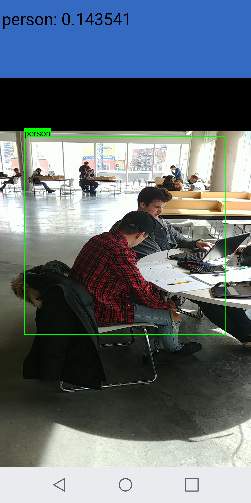

## Requirements
* Android 4.0+ support

* ARMv7 and x86 based devices

* Get the Caffe model and push it to Phone SDCard. For object detection, network(*.prototxt) should use ROILayer, you can refer to [Fast-RCNN](https://github.com/rbgirshick/fast-rcnn). For scene recognition(object recognition), it can use any caffe network and weight with memory input layer.

* Build with Gradle. You can use Android studio to build

## Demo

